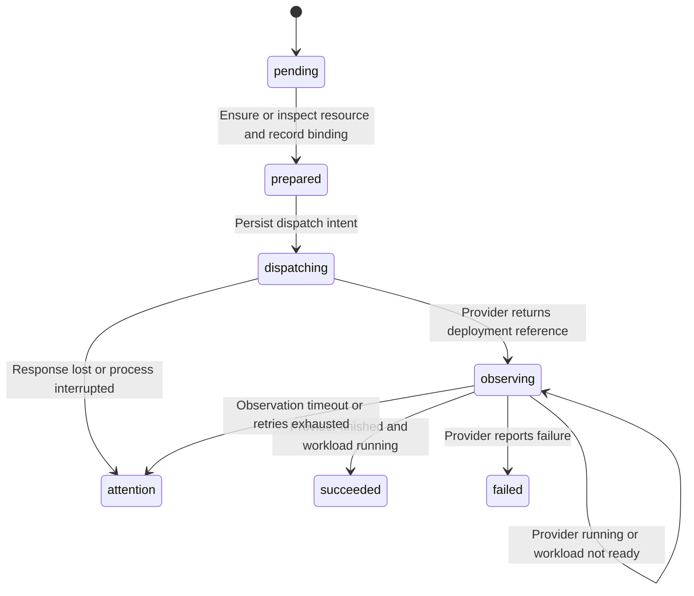

# Low level design

## Database records

| Table | Important invariants |
| --- | --- |
| oap_targets | Stable target ID; token environment reference separate from public JSON |
| oap_applications | Unique name and environment; validated base manifest |
| oap_deployments | Frozen manifest and steps; unique application and idempotency key; one active release per application |
| oap_bindings | One owner per target and resource; one resource per application component and ordinal |
| River tables | Transactional job insertion, retries, and crash recovery |

JSONB stores bounded manifests and instance steps while ownership and release
concurrency use relational constraints. All SQL parameters are bound values.
Migration execution is serialized by a database advisory lock and performed in
a transaction. SQL migrations are versioned and checksummed. Existing previews run the
idempotent first migration before additive upgrades. Applied migration contents
cannot change silently.

## Instance deployment state machine

Resource preparation is recoverable through deterministic names and ownership
markers. A create response lost in transit is recovered through scoped discovery.
A collision or duplicate owned name requires intervention rather than adoption
of an unrelated resource.

Deployment dispatch is not treated as idempotent. Persisting dispatching before
the request gives a conservative recovery boundary: a restarted worker never
blindly resubmits an uncertain request. This can produce attention even when no
request reached Coolify, which is preferable to an uncontrolled duplicate
release. An unresolved attention release blocks subsequent releases. This
milestone has no automated resolution endpoint; the provider must be inspected
and state reconciled deliberately before resuming. Provider-specific dispatch
reconciliation can improve that later.

Observation is a short job execution followed by River snooze. Each observed
state is persisted. External failures retry boundedly; exhaustion records
attention. Observation has a fifteen-minute release deadline. An interrupted
application release never silently becomes successful.

## API

The root health endpoint checks PostgreSQL reachability. All /api routes require
Bearer authentication. Application JSON rejects unknown fields and multiple JSON
documents, and request size is limited to 64 KiB. Validation normalizes defaults
before persistence. Not found, conflict, validation, authentication, and provider
errors are represented as stable code and message fields.

The OpenAPI document is docs/openapi.json. Resource discovery returns only safe
projections instead of provider objects, which can contain webhook secrets and
credentials. Logs return at most one instance's recent 100 lines through the
adapter; consolidated and live log streaming are future work.

## Coolify transport

- HTTP client has a thirty-second timeout and rejects redirects.
- Environment discovery uses GET /projects/{project}/{environment}.
- Image creation uses POST /applications/dockerimage.
- Owned resource configuration uses PATCH /applications/{uuid}.
- Deployment uses POST /deploy and requires one returned deployment UUID.
- Observation uses GET /deployments/{uuid} plus scoped application inspection.
- Coolify may encode application_id as a string and split digest images into an
  image name ending in @sha256 and a tag containing the digest. Tests cover these
  representations.
- Provider error bodies are not included in user-facing errors.

## Dashboard composition

A shared workspace shell holds navigation and authentication. Application setup,
application detail, application directory, and target discovery are separate
feature views. Reusable status, loading, and error components normalize feedback.
React Query owns server state; local form and modal state stays in React.

Polling refreshes release progress every two seconds. The UI shows real API data
and does not invent health metrics. Standard deployment requires an explicit
confirmation describing its effect. Definition creation performs no deployment.
Provider resource inspection is read-only. Layout reflows for narrow screens.

This first UI uses custom CSS alongside reusable React components. Tailwind and
shadcn/ui remain optional refinements; they are not installed. Large feature
views should be extracted as their workflows grow, rather than introducing a
shared global state layer early.

## Tests

Unit tests target manifest invariants, artifact parsing, workload health
classification, target scoping, ownership collisions, and credential-safe errors.
System tests use real PostgreSQL schemas, the HTTP API, and River workers with a
controlled operator double. They cover duplicate delivery, concurrent enqueue,
process reconstruction, ambiguous dispatch, partial failure, artifact snapshot
identity, and exclusive resource adoption.

Opt-in Coolify tests traverse the same HTTP and controller path against an
explicit staging project. They check resource lifecycle, digest identity,
provider completion, running status, logs, and an externally reachable HTTP URL.
Fixtures remain available for inspection rather than deleting operator resources.
Browser tests exercise authentication, multi-component setup, confirmation,
configuration, scoped discovery, and mobile overflow on the real local API.

## Connection pool constraints

Duplicate enqueue requests read the existing deployment through their current
transaction rather than checking out another connection while holding its
advisory lock. Deployment execution uses a dedicated, bounded-lifetime PostgreSQL
session for the advisory lock, leaving the query pool available to workers and
HTTP requests. Four execution workers can therefore add at most four lock
sessions above the configured query pool. Session advisory locks require direct
PostgreSQL connections or session-mode pooling, not transaction-mode PgBouncer.

System tests constrain the application query pool to four connections and include
concurrent duplicate deliveries and concurrent application releases. This guards
against failures hidden by a larger developer-machine connection pool.

## Definition versions and idempotency

Configuration edits and release admission share an application transaction lock.
The release snapshot is read inside that transaction, so an edit cannot race its
capture. Updates compare an expected definition version. New releases record
that version and can reject stale plans.

New idempotency fingerprints bind the declared request, not the latest mutable
definition. A retry of an already admitted request returns its original release
even after configuration edits. Earlier manifest-based fingerprints remain
readable through the legacy compatibility path.

## Owner identity foundation

Migration 006 adds the single `default` workspace and explicit workspace foreign
keys/checks on targets, applications, bindings and releases. Users represent
memberships in that one workspace, with owner/operator/viewer roles. Opaque
session/agent credentials store only hashes, kind, app scope, expiry and revocation.
Invitations store email/role-bound hashes with one-time acceptance. No public
workspace creation or signup API exists.

HTTP authorization checks current credential and membership state, CSRF/origin,
role and app scope before routing. Mutations persist an audit intent before running.
Enqueue binds its credential in the same transaction as the release/job. Owner-mode
workers recheck that live credential before release preparation and dispatch;
revocation/expiry/demotion holds work for explicit authorized recovery. Legacy
completed releases and resource IDs remain unchanged. Scope enforcement for
multiple tenants requires a future explicit migration; singleton checks currently
refuse that unsupported topology rather than silently mixing tenants.
