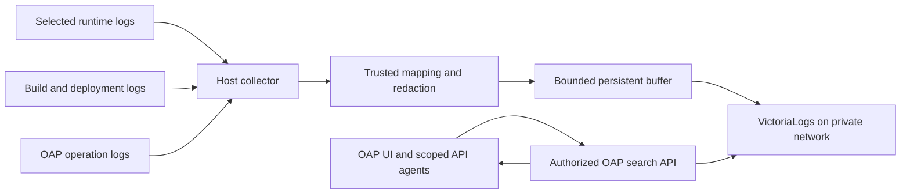

# Lightweight indexed logging and monitoring

Status: planned; no logging backend or collector has been deployed. This adds an
explicit requirement to M1 operational visibility and M4 indexed log search. The
active M0 application/environment work stays in order.

## Backend and footprint

Use optional single-node VictoriaLogs for indexed logs, with one established
collector per participating host. VictoriaMetrics is a separate optional metrics
backend; it does not replace the log store. Existing operator live logs remain
usable when indexed logging is disabled or unavailable. PostgreSQL continues to
store OAP state and audit, not bulk runtime logs.

VictoriaLogs provides automatic field indexing, full-text search and compressed
column-oriented storage. It can run as one service without external dependencies.
These are backend capabilities, not a measured OAP resource/performance claim.
See the official [quickstart](https://docs.victoriametrics.com/victorialogs/quickstart/)
and [indexing/storage explanation](https://docs.victoriametrics.com/victorialogs/faq/).

Prefer an existing VictoriaLogs endpoint when configured. A managed installation
adds one digest-pinned container with persistent storage and explicit resource
limits, plus a collector. No cluster, Kafka, Elasticsearch, Grafana or full metrics
stack is required. The native OAP UI/API supplies normal application log search;
VictoriaLogs' own UI is an optional private operator diagnostic tool.

## Data flow and operator portability

Begin with the retained Coolify staging application and controller, explicitly
selected by the owner. Collection must continue while OAP's controller is down;
its workload must not depend on log ingestion availability. Do not change Docker's
global logging driver or make existing workloads restart to enable search.

Evaluate Vector as the first Docker-host collector. Its Docker source is officially
best-effort and stateless; a durable sink buffer does not make source delivery
exactly-once. Where the existing driver is Docker `json-file`, evaluate a file
source with persistent checkpoints and rotation handling against only selected
immutable container paths. Other drivers need their own supported source or must
report unsupported collection. Do not assume every operator or Docker driver has
identical historical log access.

[Vector Docker source](https://vector.dev/docs/reference/configuration/sources/docker_logs/),
[buffering model](https://vector.dev/docs/architecture/buffering-model/), and
[VictoriaLogs Vector integration](https://docs.victoriametrics.com/victorialogs/data-ingestion/vector/)
are the implementation starting points. Prefer an already installed supported
collector over adding another agent. Validate actual driver, checkpoint and restart
behavior before selecting the shipped profile. vlagent is an alternative where its
supported inputs meet the host's needs; do not assume its Kubernetes discovery
also discovers bare Docker workloads.

Operator adapters supply read-only mapping between OAP resource IDs and immutable
runtime container IDs, plus collection capabilities. Refresh mappings on replacement
and retain historical associations. Never import container environment values.
For operators without host collection, bounded provider-log polling is an explicit
fallback with limited history and possible gaps, not a continuous collection claim.
Build/deployment logs use dedicated provider sources, distinct from runtime logs.
The current private builder discards process output: indexed build diagnostics
need a future bounded, redacted build-log artifact and reader before claiming coverage.

Do not mount an unrestricted Docker socket into OAP. A read-only socket bind still
permits mutating API calls. Prefer selected log-file access or a narrowly authorized
read proxy when runtime discovery is necessary. Collector privileges and selected
sources must be visible to the owner; never enumerate unrelated applications by default.

## Log schema and indexing

Normalize `_time` and `_msg`; preserve the source timestamp and collection timestamp.
Use trusted OAP metadata for these fields:

| Field | Purpose |
| --- | --- |
| `oap_workspace_id`, `oap_application_id` | Authorization and immutable environment-record ID |
| `oap_group_id` | Logical application context; not an authorization grant |
| `environment`, `component`, `target_id` | Placement and component filters |
| `source_kind` | Runtime, controller, build, or provider deployment |
| `resource_id`, `container_id`, `instance_ordinal` | Exact runtime identity |
| `release_id`, `operation_id`, `source_commit` | Release and lifecycle correlation when known |
| `level`, `request_id`, `trace_id` | Severity and request investigation when present |
| `event_id`, `collector_id` | Replay diagnosis and source identity |

Logical-application search resolves current member environment IDs on the server
and intersects authorization. App-scoped agents remain limited to their original
environment record. Historical group annotations do not grant sibling access or
hide old logs after metadata reorganization.

Reserve the `oap_` namespace. Workload JSON must not override ownership, environment,
resource mapping or collector authority. Treat workload-supplied IDs as untrusted
fields until correlated with authoritative metadata. Record release attribution
when collecting; do not stamp historical logs with whichever release is current
at query time. Missing correlation is explicit, not guessed.

Configure stable stream fields: workspace, application, environment, component,
target and source kind. Keep request/trace IDs, timestamps, commits, release IDs
and rotating container IDs as searchable ordinary fields. VictoriaLogs automatically
indexes fields; OAP does not create a PostgreSQL index per log field. This choice
keeps stream identity stable without sacrificing request lookup. See
[stream concepts](https://docs.victoriametrics.com/victorialogs/keyconcepts/).

Parse known structured formats with bounded field/line counts. Preserve plain text
without requiring application rewrites. Bound multiline assembly, record size and
field count; truncate with a visible marker. Drop unnecessary headers, cookies,
authentication values and configured sensitive fields before indexing. Pattern
redaction is best-effort and cannot guarantee arbitrary application logs contain
no secrets; provide owner exclusions and synthetic leakage tests.

## Native OAP search and access boundary

Add a Logs view with time range, application/environment/component/instance,
severity, text and request/trace filters. Provide surrounding context, release links,
a bounded error-count timeline and selected export. Distinguish live operator tail
from indexed history, and show collection coverage and lag next to results.

The initial API accepts typed search fields, not arbitrary backend URLs or unrestricted
LogsQL. The server compiles escaped queries and enforces authorized application,
workspace and time scope independently of user text. All backend query endpoints,
field suggestions, context and counts must apply the same boundary. Never trust
client-supplied tenant headers, resource selectors, offsets or cursors.

VictoriaLogs tenant IDs are routing/isolation identifiers, not authorization.
Keep its ingestion, query and internal/admin APIs private. OAP authenticates UI and
agents, intersects app scope and injects backend tenant/filter parameters itself.
Separate ingest and query credentials where a gateway is needed; vmauth is an
optional boundary for a shared/external backend, not mandatory infrastructure for
one private installation. See [backend security](https://docs.victoriametrics.com/victorialogs/security-and-lb/).

Proposed initial query ceilings: 15-minute default window, 24-hour maximum interactive
window, 200 default/1,000 maximum records, 5-second timeout, 2 MiB response cap and
bounded per-principal concurrency. Make these configurable downward per app.
Pagination binds the original query/scope to a signed cursor and has a stable
ordering/tie rule tested with equal timestamps. Broader exports are separately
bounded owner actions. No raw backend passthrough for agents.

Logs are untrusted evidence. Agents use the same read scope and search limits as
humans, cannot use log content as instructions, and receive only selected/redacted
windows for diagnosis. Log-query audit records scope, time range and outcome,
without copying query text that may contain personal data. Diagnostics remain
local; external sharing requires the existing opt-in preview/redaction flow.

## Retention, failure and monitoring

Propose seven-day indexed retention for the initial optional profile, a configurable
storage budget and an explicit free-space reserve. Disk retention is not a hard
instantaneous quota: daily partitions and periodic checks can exceed a configured
threshold. Combine backend controls, volume sizing, ingestion limits and disk
pressure signals. Measure before setting production CPU/RAM and disk budgets;
never advertise an untested lightweight memory ceiling. See
[VictoriaLogs retention](https://docs.victoriametrics.com/victorialogs/#retention).

Persist collector offsets and a bounded retry buffer. Back off with jitter, limit
spool disk usage and signal full buffers; never fill the application database volume
or block application requests. Expose source gaps, dropped/truncated records,
replays and ingest lag. At-least-once replay may yield duplicates unless the selected
pipeline proves deduplication; an event ID alone does not make VictoriaLogs dedupe.
Retain retired-resource mappings for the log-retention window.

M1 visibility includes controller/collector/backend health, stale mappings,
ingestion failures/lag, disk pressure and retention status. M4 adds saved searches,
log-derived error rates and owner-defined alert rules through the notification
outbox. Optional VictoriaMetrics integration can store CPU/RAM/restart counters
and metrics; reuse a configured metrics backend before deploying another service.
No log content is sent to telemetry by enabling local indexing.

Workloads and ordinary OAP lifecycle operations continue during log-backend failure.
The Logs view reports indexed search unavailable and offers supported live-tail
fallback without confusing empty results with no logs. Restart preserves indexed
history and checkpoints. Treat operational logs as expiring history rather than
mandatory user-data backups; archive selected windows only when requested. OAP's
authoritative audit remains backed up in PostgreSQL. If log archives are promised,
restore testing and retention policies are separate requirements.

## Delivery and acceptance

1. M1: logging schema, collection capability/coverage, health and bounded live logs.
2. M4: optional VictoriaLogs adapter and reproducible synthetic ingestion/search fixture.
3. Add the host collector profile and immutable operator-resource mapping.
4. Ship native scoped UI/API search and bounded read-only MCP tools.
5. Validate retention, failure recovery and chosen alerts on isolated staging.

Required system tests: two applications/tokens cannot cross-query; spoofed ownership
fields and query/cursor injection cannot widen scope; exact request IDs remain
searchable; escaped text and equal timestamps paginate correctly; replacement keeps
old-release correlation; source rotation and collector/backend restarts report replay
and gaps accurately; retention/disk pressure, outage/full buffer and oversized logs
remain bounded; synthetic secrets are excluded; missing logs differ from zero errors.
Record dataset, ingest rate, peak memory/CPU, storage growth and p50/p95 query latency
for short/long windows. Do not accept proper indexing or lightweight operation on a
UI demonstration alone. Pin tested backend/collector versions and digests at delivery.
