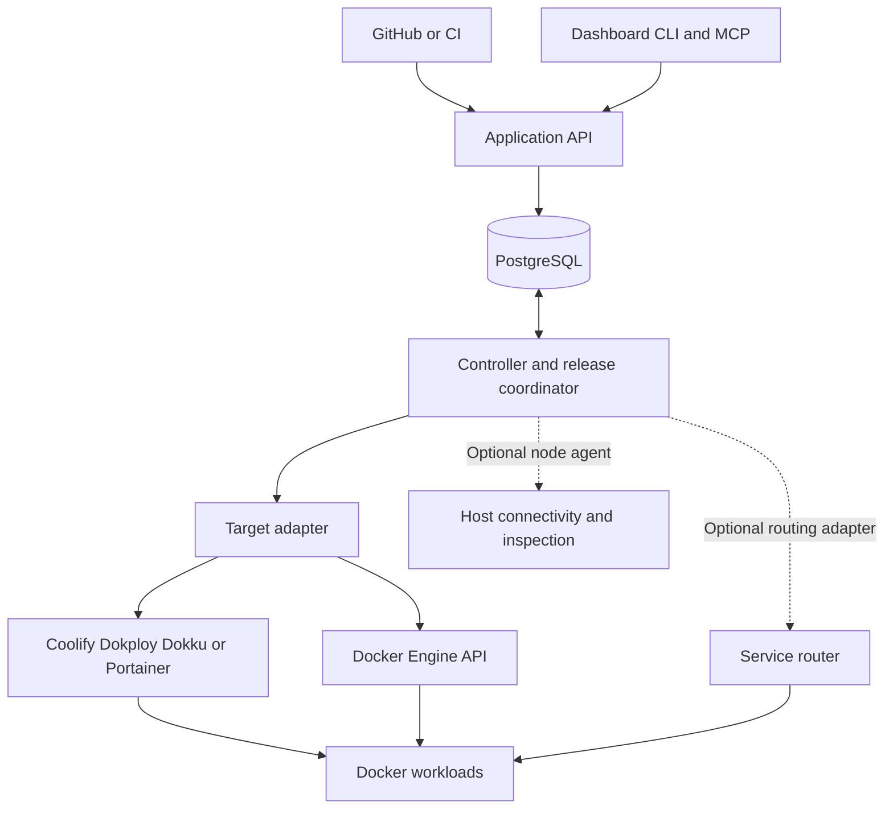

# OpenAppPlatform Product and Architecture Draft

OpenAppPlatform is an application-first Docker control plane that manages complete applications directly on Docker Engine or through deployment operators such as Coolify, Dokploy, Dokku, and Portainer. The intended experience follows DigitalOcean App Platform: users work with applications, components, environments, and releases while retaining their existing Docker infrastructure.

Status: Draft design, 9 October 2026. Product name: OpenAppPlatform. Bare Docker and Coolify are first-class initial targets. This records the agreed direction and proposed implementation; no infrastructure changes are authorized by this document.

The [roadmap delivery queue](../ROADMAP.md#m0-core-workflow-delivery-queue)
is the current execution order and separates implemented behavior from future
contracts. Finish Coolify runtime configuration/connections, then prioritize guided
assembly, GitHub release ownership, environment organization, readiness/recovery,
and stable routing. Auth/agent/AI work follows the usable core. Technology choices
below remain proposals where they differ from the implementation; additional
frameworks or services are not required to satisfy the product model.


## Product direction

Users should be able to connect repositories, define components, select an existing deployment target, and deploy a complete application. Existing resources can be adopted rather than recreated.

The platform groups frontend, API, workers, scheduled jobs, and linked dependencies under one application. It provides shared configuration, a coherent release view, combined health and logs, and application-level API, CLI, and MCP operations.

The primary audience runs products with several components or manages many similar applications. A single simple workload may not justify an additional management layer.

## User benefits

| Current difficulty | Platform capability |
| --- | --- |
| Components are scattered across operator resources | One application with component ownership and combined status |
| Release progress requires inspecting several pages | One release view showing each component version and outcome |
| Setup repeats across applications and environments | Reusable application definitions and environment configuration |
| Failures require navigating settings and logs | Evidence-linked diagnostics and suggested next actions |
| Agents require operator-specific commands and IDs | Application-level API, CLI, and MCP tools |
| Deployment platforms differ between installations | Common operations backed by capability-aware adapters |

The platform adds application lifecycle coordination. It does not promise server availability, atomic releases, or identical capabilities across every operator.

## Decisions

- Preserve the existing Coolify investment and support adoption of current resources.
- Use a generic Docker application model with a direct Docker adapter and operator adapters.
- Treat DigitalOcean App Platform as the experience reference.
- Start with standard operator deployments.
- Make rolling and blue-green deployment optional, selectable capabilities.
- Separate deployment strategy from automatic versus manual promotion.
- Keep deployment execution deterministic; AI uses the same authorized operations as the UI.
- Use Go, React and TypeScript, and PostgreSQL as the proposed stack.
- Begin with one controller application and a PostgreSQL database.
- Support bare Docker Engine and Coolify in the initial delivery; add other operator adapters incrementally.

## Application experience

An application contains environments. Each environment contains components and linked dependencies.

Example:

```text
Talintr
└── Production
    ├── Frontend
    ├── API
    ├── Background worker
    ├── Scheduled job
    └── PostgreSQL dependency
```

The application view includes overview, components, deployments, configuration, domains, and logs. Operator resource references remain available for troubleshooting.

A release can be incomplete: the frontend may serve a new version while a failed API deployment leaves the previous version active. The UI must report the actual component state rather than marking the whole release successful.

## Architecture



The controller owns desired application state, resource mappings, release sequencing, and reconciliation. On operator-backed targets, operators own the underlying resources and their normal container lifecycle. On bare Docker targets, OpenAppPlatform manages explicitly owned containers and networks through Docker Engine; Docker restart policies provide local process recovery.

Routing is a separate adapter. A node agent is optional and fills verified API gaps; it must not independently recreate operator-owned containers. Neither routing nor a node agent is a prerequisite for the initial standard-deployment experience.

## Domain model

| Entity | Responsibility |
| --- | --- |
| Application | Product-level identity and component definitions |
| Environment | Configuration and placement for staging or production |
| Component | HTTP service, worker, scheduled job, or static frontend |
| Dependency | Linked database, queue, storage, or external service |
| Target | Direct Docker or operator connection and server placement |
| Instance | Independently replaceable workload mapped to a container or operator resource |
| Release | Immutable component versions and configuration snapshot |
| Deployment | An attempt to apply a release with recorded steps and outcomes |
| Route | Stable public or private endpoint and active backends |
| Operation | Durable record of an action and its progress |

Desired state and observed state are separate. Releases track versions across components but are not atomic transactions.

## Operator adapter design

Adapters implement discovery, adoption, instance creation, deployment, inspection, endpoint resolution, stop, removal, and bounded logs. Each reports capabilities for the actual target and operator version.

Capabilities include immutable artifact deployment, isolated replacement creation, private endpoint access, graceful shutdown configuration, deployment observation, network attachment, and native rolling updates.

| Operator | Proposed integration | Mapping to validate |
| --- | --- | --- |
| Coolify | REST API | Application resources or reusable deployment slots |
| Dokploy | API or CLI | Application resources or supported Swarm services |
| Dokku | SSH commands | Applications and process types |
| Portainer | REST API | Isolated stacks or services appropriate to the environment |
| Bare Docker | Local Unix socket, SSH, or mutually authenticated TLS | Owned containers, networks, and explicitly managed volumes |

Adapters ship as Go packages initially. An external plugin protocol is deferred.

Unsupported requested behavior produces a clear planning error. The platform must never silently downgrade a zero-unavailable rollout to a stop-and-restart deployment.

## GitHub and build lifecycle

For adopted components, GitHub events enter the platform controller. Direct operator automatic deployment is disabled while the source connection is retained. Bare Docker targets use the same webhook and release coordinator without requiring another deployment platform. There must be one owner of release sequencing.

The controller verifies webhook signatures, deduplicates deliveries, maps repositories and branches to components, records the exact commit, and serializes deployments for a component.

Build and deployment are separate contracts. Initially, Coolify can continue building where exact-version behavior is verified. The portable deployment contract is an immutable image digest produced once and reused across instances. CI builds are an optional evolution, not an initial migration requirement.

Repository events affecting multiple components can create one release with an explicit affected-component set. Superseding queued releases and monorepo change detection remain policy decisions.

## Deployment strategies

| Strategy | Behavior | Initial scope |
| --- | --- | --- |
| Standard | Use the operator lifecycle or direct Docker replacement and observe the outcome | Included |
| Rolling | Prepare replacements, check readiness, add traffic, drain old instances | Deferred |
| Blue-green | Prepare an inactive release slot, verify it, and promote routing | Deferred |

The user selects strategies per component, with application defaults. Promotion policy is separate: automatic after verification or manual approval.

Standard deployment has the operator's availability behavior or, on bare Docker, a documented stop-and-replace lifecycle with possible downtime. The platform must display that behavior and does not imply downtime-free operation.

For rolling deployment, the controller can manage independent replacements or delegate to a verified native strategy. Preparation, health checks, routing changes, and retirement are persisted steps.

Blue-green remains optional. Stateless HTTP components can use release slots, while workers require queue-safe handover and scheduled jobs need a single active scheduler. Shared databases and uploads remain outside release slots. Database changes must remain compatible with both versions during a transition; rollback cannot reverse arbitrary data changes.

## Networking and availability

Application-level endpoints should remain stable across instance changes. Future routing adapters publish versioned backend configurations, acknowledge the applied version, and support backend removal and connection draining.

Candidate releases may require release-scoped internal routes so candidate components communicate with one another. Public traffic can enter through an operator proxy and forward to a dedicated router when necessary. Bare Docker targets can use explicit host port mappings or a supported routing adapter; domain and TLS support must be provided explicitly.

An adapter must provide a reachable endpoint for verification. If operator APIs cannot supply private connectivity, the target requires a supported network configuration or node agent.

Application replacement on one server cannot provide availability through that server's failure. Multi-target recovery requires another available server, shared state, and sufficient capacity. Existing workloads and routing should continue serving when the controller is unavailable.

## Reliability and ownership

Every mutating operation is recorded before execution. Each step can be retried and reconciled against observed operator state. At-least-once jobs and API retries must not create uncontrolled duplicate resources.

Use per-component deployment locks with ownership and expiry, operation IDs, reconciliation, and bounded retries. Resource identifiers and ownership metadata let adapters recover after a successful mutation with a lost response.

Adoption is explicit. Existing databases and volumes must not be recreated or removed as a side effect of importing an application. Destructive cleanup is separate from normal reconciliation.

Persist release artifacts or their retrievable references, configuration versions, deployment steps, routing versions, and failure evidence. Document controller database backup and restore.

## Technology stack

| Layer | Proposed choice |
| --- | --- |
| API and controller | Go with standard net/http |
| Adapters | Go interfaces and packages |
| State | PostgreSQL |
| Database access | pgx and sqlc |
| Background jobs | River using PostgreSQL |
| Dashboard | React, TypeScript, and Vite |
| Navigation and API state | React Router and TanStack Query |
| UI foundation | Tailwind CSS and shadcn/ui |
| Live progress and logs | Server-Sent Events |
| API contract | OpenAPI with generated clients |
| Packaging | Multi-stage Docker image serving compiled UI and API |

The release state machine is persisted explicitly. River executes jobs; it is not the release model. Per-component serialization belongs to the controller.

Use the owner's existing PostgreSQL deployment with a dedicated database and role when suitable. API and worker can share one process initially and later run separately. Node agents, if required, can also use Go.

Routing technology remains an implementation decision for advanced strategies. Redis, a separate workflow engine, and separate adapter processes are not initial dependencies.

## AI and agent capabilities

The same authorized application API powers the UI, CLI, MCP tools, and assistant. Responses expose operation IDs, targets, requested changes, phases, observed outcomes, structured failures, evidence, and valid next actions.

Initial capabilities:
- Application and deployment inspection through structured tools.
- Read-only failure diagnosis grounded in bounded logs and configuration evidence.
- Release comparison and component health explanations.
- Draft configuration and action plans for user review.

Later capabilities:
- Approved configuration changes, retries, deployment, and scaling.
- Repository-assisted application setup.

AI cannot invent an alternate deployment path or bypass permissions. Mutation policies apply equally to humans and tools. Logs and repository content are untrusted evidence, and secrets are excluded from model context. Diagnosis must distinguish observed facts from suggestions.

The model provider stays behind an interface. Core deployment operations continue when AI is unavailable. Model selection, authentication integration, and usage budgets remain open.

## Initial delivery scope

1. Application, environment, component, and release model.
2. Existing-resource discovery and explicit adoption through Coolify.
3. Standard deployment with exact version tracking and durable progress.
4. GitHub event handling with deduplication and component deployment serialization.
5. Unified status, bounded logs, configuration, and partial-failure reporting.
6. Structured API, MCP tools, and read-only AI diagnosis.
7. First-class direct Docker Engine deployment alongside Coolify, with shared adapter contract tests.

Follow with health-gated replacement deployments, routing integration, scaling, and optional blue-green.

Do not make a two-slot deployment mechanism mandatory for the first version. The first version establishes application management and honest visibility while preserving user-selected deployment behavior.

## Acceptance criteria

- Existing Coolify resources can be adopted without recreation or data loss.
- An application can deploy to a server with Docker Engine and no Coolify, Dokploy, Dokku, Portainer, Swarm, or Kubernetes installation.
- Bare Docker deployments support immutable images, configuration, health inspection, bounded logs, stop, and restart.
- Direct Docker reconciliation affects only explicitly owned or adopted resources and retains durable volumes.
- One application presents all components and their actual running versions.
- Duplicate GitHub deliveries do not start duplicate logical deployments.
- Controller restart resumes or reconciles an interrupted operation.
- Lost operator responses do not leave unmanaged duplicates.
- Concurrent releases for a component follow a defined serialization policy.
- Operator acceptance of a deployment is distinct from verified deployment completion.
- Partial failures remain visible with supporting evidence.
- Requested strategies are checked against adapter capabilities.
- Standard deployments disclose operator availability behavior.
- AI tools enforce the same access and approval rules as the UI.
- Secrets are absent from model inputs, ordinary logs, and generated plans.

## Open decisions

- Whether the initial audience is one owner or multiple teams.
- Authentication, roles, invitation model, and environment approval policies.
- Exact Coolify versions and API capabilities to support.
- Docker Engine versions, connection modes, and host platforms to support.
- Build artifact storage and exact-commit deployment support.
- Routing technology and private network setup for advanced strategies.
- AI providers, model selection, budgets, and context retention.
- Manifest synchronization with dashboard edits and Git ownership.
- Release supersession, dependencies, scheduled jobs, and migration policies.
- Deployment log retention and observability requirements.

## Technical references

These references support integration feasibility; adapter guarantees require version-specific contract tests.

- [Coolify API](https://coolify.io/docs/api/overview)
- [Coolify automatic deployments](https://coolify.io/docs/applications/deployments/automatic-deployments)
- [Coolify deployment lifecycle](https://coolify.io/docs/applications/deployments/overview)
- [Dokploy deployment options](https://docs.dokploy.com/docs/core/deployment-options)
- [Dokku deployment checks](https://dokku.com/docs/deployment/zero-downtime-deploys/)
- [Portainer API](https://docs.portainer.io/api/examples)
- [River documentation](https://riverqueue.com/docs)
- [sqlc documentation](https://docs.sqlc.dev/en/latest/)
